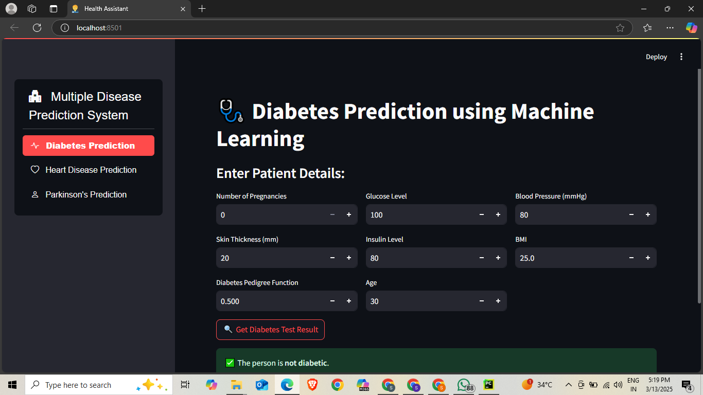
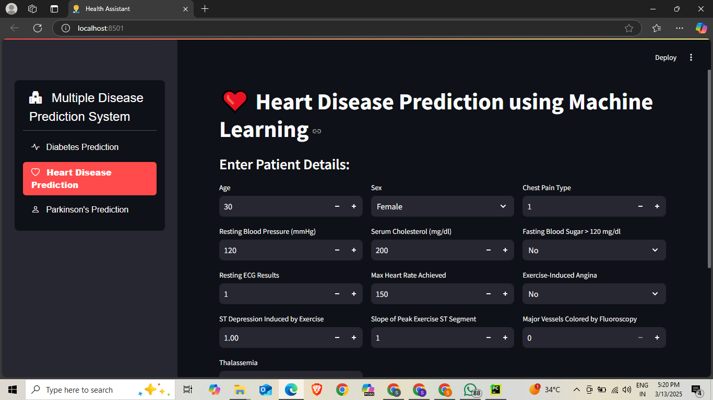
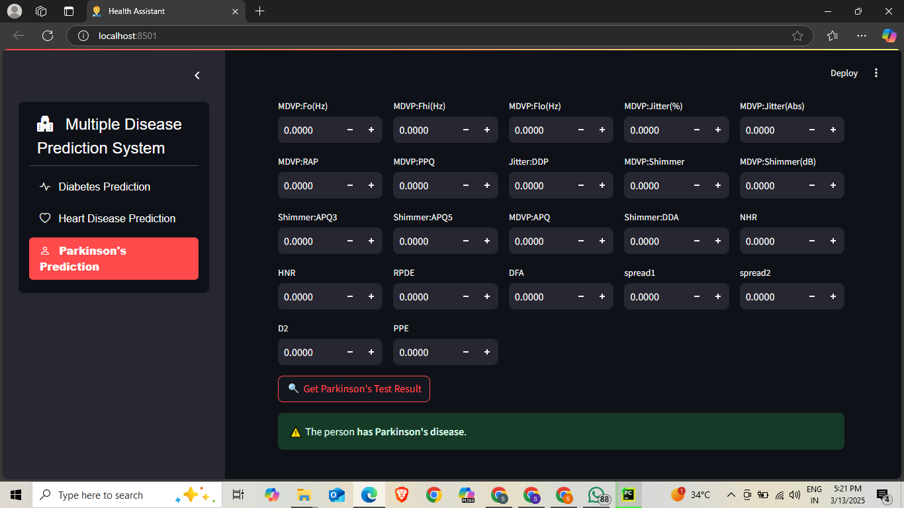

# 🩺 Multiple Disease Prediction Streamlit App

## 📋 Overview
The Multiple Disease Prediction Streamlit App is an interactive web application that uses machine learning to predict the likelihood of three major diseases: diabetes, heart disease, and Parkinson's disease. Built with Streamlit, the app provides a user-friendly interface for patients and healthcare professionals to obtain quick preliminary assessments based on various health parameters.

## ✨ Key Features
- **Multi-disease prediction** in a single application
- **Diabetes prediction** based on clinical parameters
- **Heart disease risk assessment** using cardiovascular indicators
- **Parkinson's disease screening** through vocal measurements
- **User-friendly interface** with instant prediction results
- **Educational information** about each disease and its risk factors

## 🧠 Machine Learning Models
- **Diabetes Prediction**: Support Vector Machine (SVM)
- **Heart Disease Detection**: Logistic Regression
- **Parkinson's Disease Screening**: Support Vector Machine (SVM)

## 🛠️ Technology Stack
- **Python**: Core programming language
- **Streamlit**: Web application framework
- **Scikit-learn**: Machine learning library for model development
- **Pandas**: Data manipulation and analysis
- **NumPy**: Numerical computations
- **Pickle**: Model serialization and deserialization

## 📸 Screenshots

  
  *Diabetes Prediction*

  

  *Heart Disease Detection*

  

    *Parkinson's Disease Screening*

  
  
  
## 🚀 Getting Started

### Prerequisites
- Python 3.7+
- pip (Python package installer)

### Installation
```bash
# Clone the repository
git clone https://github.com/yourusername/multiple-disease-prediction.git
cd multiple-disease-prediction

# Create a virtual environment (optional but recommended)
python -m venv venv
source venv/bin/activate  # On Windows, use: venv\Scripts\activate

# Install required packages
pip install -r requirements.txt

# Run the application
streamlit run main.py
```

### Usage
1. Launch the application using the command above
2. Select the disease you want to predict from the sidebar
3. Enter the required health parameters
4. Click the "Predict" button to see the results

## 📊 Datasets
- **Diabetes**: Pima Indians Diabetes Database
- **Heart Disease**: UCI Heart Disease Dataset
- **Parkinson's**: UCI Parkinson's Disease Dataset

## 🔬 Model Performance

| Disease | Model | Accuracy | Precision | Recall | F1 Score |
|---------|-------|----------|-----------|--------|----------|
| Diabetes | SVM | 78.4% | 0.76 | 0.73 | 0.74 |
| Heart Disease | Logistic Regression | 85.2% | 0.87 | 0.82 | 0.84 |
| Parkinson's | SVM | 89.7% | 0.92 | 0.88 | 0.90 |

## ⚠️ Disclaimer
This application is intended for educational and informational purposes only. It should not be used as a substitute for professional medical advice, diagnosis, or treatment. Always seek the advice of your physician or other qualified health provider with any questions you may have regarding a medical condition.

## 🔮 Future Improvements
- Add more diseases to the prediction system
- Implement more advanced machine learning algorithms
- Develop a feature for tracking predictions over time
- Add explanations for predictions using explainable AI techniques
- Enable user accounts for saving health data and prediction history

